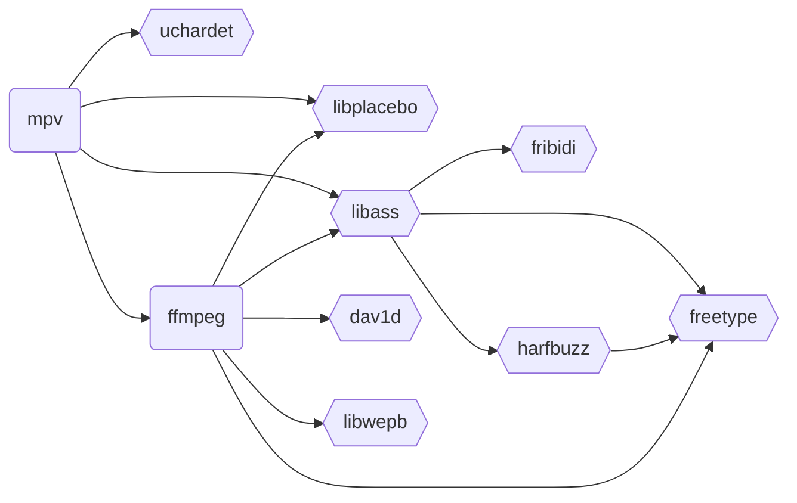

# MediaKit

## Dependencies

| Dependency                     | License           | Commercial Use |
| ------------------------------ | ----------------- | -------------- |
| [FFmpeg][ffmpeg]               | LGPL-2.1-or-later | ✅             |
| [mpv][mpv]                     | LGPL-2.1-or-later | ✅             |
| [dav1d][dav1d]                 | BSD-2-Clause      | ✅             |
| [libjpeg-turbo][libjpeg-turbo] | IJG               | ✅             |
| [libplacebo][libplacebo]       | LGPL-2.1-or-later | ✅             |
| [libwebp][libwebp]             | BSD-3-Clause      | ✅             |
| [SDL][sdl]                     | Zlib              | ✅             |

[ffmpeg]: https://ffmpeg.org
[mpv]: https://mpv.io
[dav1d]: https://code.videolan.org/videolan/dav1d
[libjpeg-turbo]: https://libjpeg-turbo.org
[libplacebo]: https://libplacebo.org
[libwebp]: https://github.com/webmproject/libwebp
[sdl]: https://www.libsdl.org

